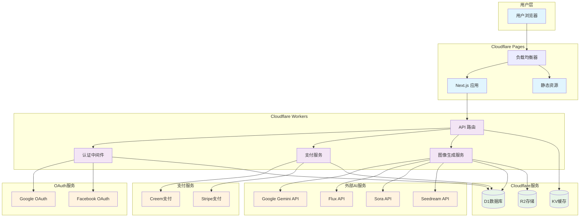

# 系统架构图

## 技术栈说明

### 前端层
- **Next.js 16**: React 全栈框架
- **React 19**: UI 组件库
- **TypeScript**: 类型安全
- **Tailwind CSS**: 样式框架

### 后端层
- **Cloudflare Workers**: 服务端运行时
- **NextAuth.js**: OAuth 认证
- **D1 数据库**: SQLite 存储
- **R2 存储**: 图像文件存储

### 外部服务
- **AI 模型**: Gemini, Flux, Sora, Seedream
- **支付**: Creem, Stripe
- **认证**: Google, Facebook OAuth

### 部署架构
- **CDN**: Cloudflare 全球分发
- **边缘计算**: 25+ 地区部署
- **无服务器**: 按需扩缩容