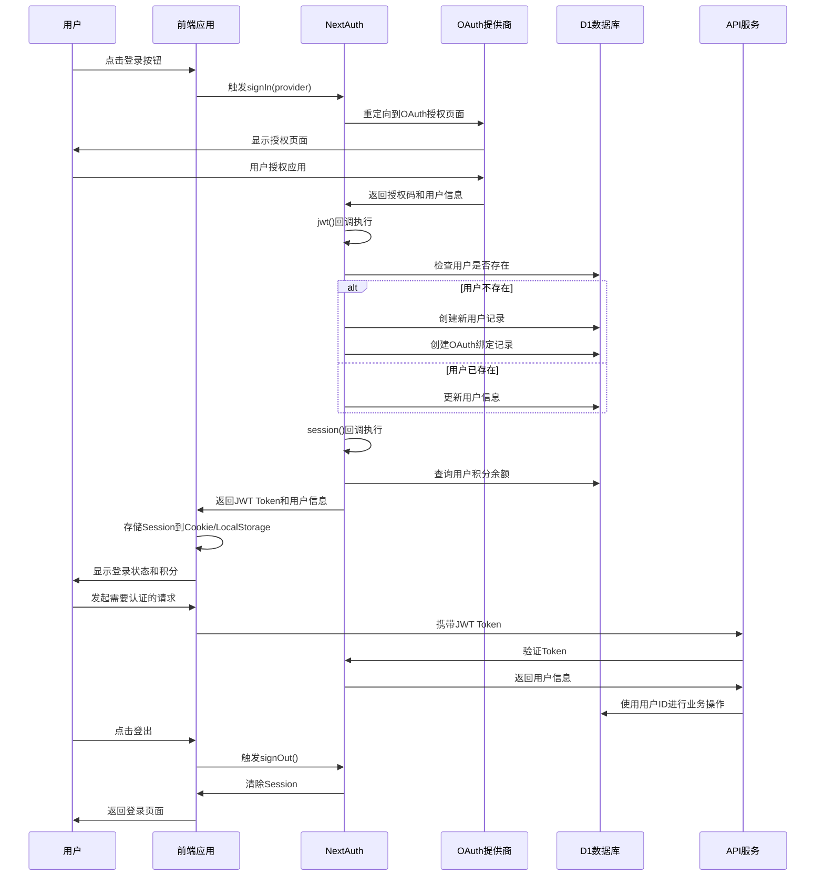

# 用户认证流程图



## 认证流程详细说明

### 1. OAuth登录流程
- **支持提供商**: Google, Facebook
- **认证方式**: Authorization Code Flow
- **Scope**: email, profile, picture

### 2. 用户数据同步
```typescript
// JWT回调中的用户数据处理
async jwt({ token, account, profile }) {
    if (account?.provider && account.providerAccountId) {
        const user = await ensureUserFromOAuth({
            provider: account.provider,          // 'google' | 'facebook'
            providerAccountId: account.providerAccountId,
            email: profile.email,
            name: profile.name,
            avatarUrl: profile.picture
        });
        token.userId = user.id;  // 内部用户ID
    }
    return token;
}
```

### 3. Session增强
```typescript
// Session回调中添加业务数据
async session({ session, token }) {
    if (session.user && token.userId) {
        session.user.id = token.userId;
        const user = await getUserById(token.userId);
        session.user.credits = user?.credits_balance ?? 0;
    }
    return session;
}
```

### 4. 数据库表结构

**users表**:
```sql
CREATE TABLE users (
    id TEXT PRIMARY KEY,           -- UUID
    email TEXT NOT NULL UNIQUE,    -- 邮箱
    name TEXT,                     -- 显示名称
    avatar_url TEXT,              -- 头像URL
    credits_balance INTEGER DEFAULT 0, -- 积分余额
    created_at INTEGER NOT NULL,
    updated_at INTEGER NOT NULL
);
```

**oauth_accounts表**:
```sql
CREATE TABLE oauth_accounts (
    id TEXT PRIMARY KEY,
    user_id TEXT NOT NULL,
    provider TEXT NOT NULL,           -- 'google' | 'facebook'
    provider_account_id TEXT NOT NULL,
    created_at INTEGER NOT NULL,
    UNIQUE(provider, provider_account_id),
    FOREIGN KEY(user_id) REFERENCES users(id)
);
```

### 5. 安全特性

#### JWT配置
- **Secret**: 环境变量配置
- **策略**: JWT Session (无状态)
- **过期**: 默认配置

#### 安全措施
- HTTPS强制
- CSRF保护
- Session劫持防护
- OAuth State参数验证

#### 错误处理
- 授权失败回退
- 网络错误重试
- 数据库异常处理
- 生产环境错误上报

### 6. 认证中间件

```typescript
// API路由认证检查
export async function requireAuth(req: NextRequest) {
    const session = await getServerSession(authOptions);
    if (!session?.user?.id) {
        return NextResponse.json(
            { error: "请先登录" },
            { status: 401 }
        );
    }
    return session;
}
```

### 7. 前端集成

#### React Context
```typescript
// 认证状态管理
const AuthContext = createContext<{
    session: Session | null;
    loading: boolean;
    login: (provider: string) => void;
    logout: () => void;
}>({});
```

#### 路由保护
```typescript
// HOC保护需要认证的页面
const withAuth = (Component: React.ComponentType) => {
    return function AuthenticatedComponent(props: any) {
        const { session, loading } = useAuth();

        if (loading) return <Loading />;
        if (!session) return <LoginPrompt />;

        return <Component {...props} />;
    };
};
```