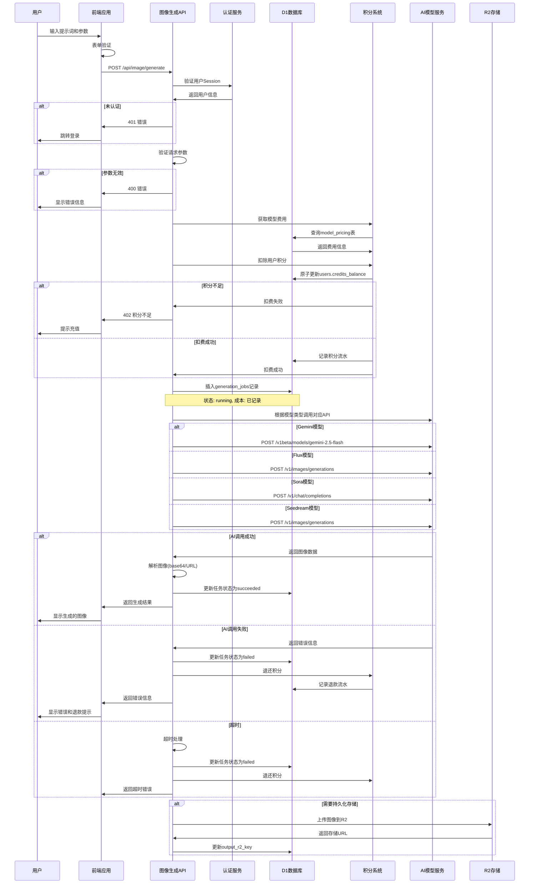

# 图像生成流程图



## 图像生成技术流程

### 1. 支持的AI模型

#### Gemini系列
```typescript
// Gemini 2.5 Flash (nano-banana)
const geminiRequest = {
    contents: [{ parts: [{ text: prompt }], role: "user" }],
    generationConfig: {
        responseModalities: ["IMAGE"],
        imageConfig: { aspectRatio, imageSize },
    },
};

// Gemini 3 Pro (nano-banana-pro)
const geminiProRequest = {
    // 支持更高分辨率，更高质量
    imageSize: "4K", // 360秒超时
};
```

#### Flux系列
```typescript
// Flux-kontext-pro/max
const fluxRequest = {
    model: "flux-kontext-pro",
    prompt: prompt,
    aspect_ratio: aspectRatio,
    response_format: "b64_json",
};

// 支持参考图像编辑
if (referenceImages.length > 0) {
    const formData = new FormData();
    formData.append("image", imageBlob);
    formData.append("prompt", prompt);
}
```

#### Sora Image
```typescript
// 基于Chat Completion的图像生成
const soraRequest = {
    model: "sora_image",
    messages: [{
        role: "user",
        content: [
            { type: "text", text: prompt },
            ...referenceImages.map(url => ({
                type: "image_url",
                image_url: { url }
            }))
        ]
    }],
};
```

### 2. 积分计费策略

| 模型 | 积分成本 | 分辨率 | 超时时间 |
|------|----------|--------|----------|
| nano-banana | 2 | 1K/2K | 180s/300s |
| nano-banana-pro | 4 | 1K/2K/4K | 180s/300s/360s |
| seedream-4.0 | 5 | 1K/2K/4K | 240s |
| sora-image | 6 | 标准 | 240s |
| flux-kontext-pro | 3 | 1K/2K | 240s |
| flux-kontext-max | 8 | 1K/2K | 240s |

### 3. 错误处理机制

#### 原子扣费保证
```typescript
const chargeCredits = async ({ userId, amount, reason, refId }) => {
    // 原子操作：检查余额并扣费
    const update = await db.prepare(
        `UPDATE users SET credits_balance = credits_balance - ?
         WHERE id = ? AND credits_balance >= ?`
    ).bind(amount, userId, amount).run();

    if (update.meta.changes !== 1) {
        return false; // 余额不足
    }

    // 记录流水
    await db.prepare(
        `INSERT INTO credit_ledger(...) VALUES(...)`
    ).run();
    return true;
};
```

#### 自动退款机制
```typescript
const handleGenerationFailure = async (jobId, userId, cost, error) => {
    // 更新任务状态
    await db.prepare(
        `UPDATE generation_jobs SET status = 'failed', error = ? WHERE id = ?`
    ).bind(error, jobId).run();

    // 自动退款
    await refundCredits({
        userId,
        amount: cost,
        reason: "generation_refund",
        refId: jobId
    });
};
```

### 4. 任务状态管理

#### 状态机
```
queued -> running -> succeeded
        \-> failed
```

#### 数据库记录
```sql
CREATE TABLE generation_jobs (
    id TEXT PRIMARY KEY,
    user_id TEXT NOT NULL,
    model_key TEXT NOT NULL,
    cost_credits INTEGER NOT NULL,
    prompt TEXT NOT NULL,
    aspect_ratio TEXT,
    image_size TEXT,
    status TEXT NOT NULL,  -- 'running'|'succeeded'|'failed'
    error TEXT,
    output_r2_key TEXT,
    created_at INTEGER NOT NULL,
    updated_at INTEGER NOT NULL
);
```

### 5. 性能优化

#### 超时控制
```typescript
const fetchWithTimeout = async (url, init, timeoutMs) => {
    const controller = new AbortController();
    const timer = setTimeout(() => controller.abort(), timeoutMs);

    try {
        return await fetch(url, { ...init, signal: controller.signal });
    } finally {
        clearTimeout(timer);
    }
};
```

#### 并发限制
- 单用户并发限制
- 全局请求队列
- 资源使用监控

#### 缓存策略
- 模型配置缓存
- 用户积分缓存
- 响应结果缓存

### 6. 监控和日志

#### 关键指标
- 生成成功率
- 平均响应时间
- 错误分布
- 积分消费统计

#### 日志记录
```typescript
console.log(`[generation] User: ${userId}, Model: ${model}, Cost: ${cost}`);
console.error(`[generation] Failed: ${error}, Job: ${jobId}`);
```

### 7. 安全考虑

#### 输入验证
- 提示词长度限制
- 恶意内容检测
- 参数范围验证

#### 资源保护
- 请求频率限制
- 单次生成成本上限
- 批量操作限制

#### 数据隐私
- 提示词脱敏存储
- 生成结果访问控制
- 用户数据隔离