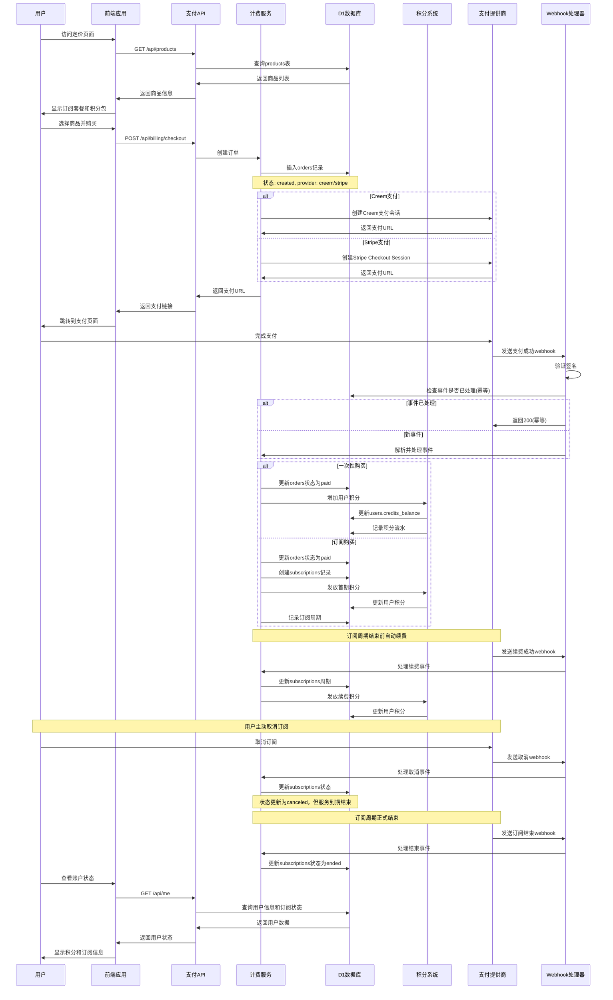

# 支付订阅流程图



## 支付系统详细设计

### 1. 商品类型定义

#### 一次性积分包
```typescript
type OneTimeProduct = {
    id: string;
    type: 'one_time';
    name: string;           // "100积分包"
    credits: number;        // 100
    price: number;          // 9.99 (USD)
    currency: string;       // "USD"
    active: boolean;
};
```

#### 订阅套餐
```typescript
type SubscriptionProduct = {
    id: string;
    type: 'subscription';
    name: string;           // "专业版月度订阅"
    credits: number;        // 500 (每月发放)
    billingCycle: 'monthly' | 'yearly';
    price: number;          // 19.99
    currency: string;       // "USD"
    active: boolean;
};
```

### 2. 支付提供商配置

#### Creem配置
```typescript
const creemConfig = {
    apiKey: process.env.CREEM_API_KEY,
    webhookSecret: process.env.CREEM_WEBHOOK_SECRET,
    baseUrl: 'https://api.creem.io',
};
```

#### Stripe配置
```typescript
const stripeConfig = {
    secretKey: process.env.STRIPE_SECRET_KEY,
    webhookSecret: process.env.STRIPE_WEBHOOK_SECRET,
    publishableKey: process.env.STRIPE_PUBLISHABLE_KEY,
};
```

### 3. 数据库表结构

#### products表
```sql
CREATE TABLE products (
    id TEXT PRIMARY KEY,
    type TEXT NOT NULL,                    -- 'subscription' | 'one_time'
    name TEXT NOT NULL,
    credits INTEGER NOT NULL,              -- 发放积分数
    active INTEGER NOT NULL DEFAULT 1,
    provider_product_ref TEXT,             -- JSON: {creem:{...}, stripe:{...}}
    created_at INTEGER NOT NULL,
    updated_at INTEGER NOT NULL
);
```

#### orders表
```sql
CREATE TABLE orders (
    id TEXT PRIMARY KEY,
    user_id TEXT NOT NULL,
    provider TEXT NOT NULL,                -- 'creem' | 'stripe'
    provider_order_id TEXT NOT NULL,
    type TEXT NOT NULL,                    -- 'subscription' | 'one_time'
    product_id TEXT,
    status TEXT NOT NULL,                  -- 'created'|'paid'|'failed'|'refunded'
    amount INTEGER,                        -- 金额(分)
    currency TEXT,                         -- 'USD'|'SGD'
    created_at INTEGER NOT NULL,
    updated_at INTEGER NOT NULL,
    UNIQUE(provider, provider_order_id),
    FOREIGN KEY(user_id) REFERENCES users(id),
    FOREIGN KEY(product_id) REFERENCES products(id)
);
```

#### subscriptions表
```sql
CREATE TABLE subscriptions (
    id TEXT PRIMARY KEY,
    user_id TEXT NOT NULL,
    provider TEXT NOT NULL,                -- 'creem' | 'stripe'
    provider_customer_id TEXT,
    provider_subscription_id TEXT NOT NULL,
    status TEXT NOT NULL,                  -- 'active'|'canceled'|'ended'
    current_period_start INTEGER,
    current_period_end INTEGER,
    canceled_at INTEGER,
    ended_at INTEGER,
    created_at INTEGER NOT NULL,
    updated_at INTEGER NOT NULL,
    UNIQUE(provider, provider_subscription_id),
    FOREIGN KEY(user_id) REFERENCES users(id)
);
```

### 4. Webhook事件处理

#### 统一事件格式
```typescript
type BillingEvent = {
    type: 'ONE_TIME_PAID' | 'SUBSCRIPTION_PERIOD_PAID' | 'SUBSCRIPTION_ENDED';
    provider: 'creem' | 'stripe';
    providerEventId: string;
    userId: string;
    productId: string;
    credits: number;
    // 订阅特有字段
    periodStart?: number;
    periodEnd?: number;
    status?: string;
};
```

#### 事件处理流程
```typescript
const handleBillingEvent = async (event: BillingEvent) => {
    // 幂等性检查
    const existingEvent = await db.prepare(
        `SELECT id FROM provider_events WHERE provider = ? AND event_id = ?`
    ).bind(event.provider, event.providerEventId).first();

    if (existingEvent) {
        return; // 已处理，直接返回
    }

    // 标记事件已处理
    await db.prepare(
        `INSERT INTO provider_events(id, provider, event_id, received_at) VALUES(?, ?, ?, ?)`
    ).bind(newId(), event.provider, event.providerEventId, nowSeconds()).run();

    // 业务处理
    switch (event.type) {
        case 'ONE_TIME_PAID':
            await handleOneTimePaid(event);
            break;
        case 'SUBSCRIPTION_PERIOD_PAID':
            await handleSubscriptionPaid(event);
            break;
        case 'SUBSCRIPTION_ENDED':
            await handleSubscriptionEnded(event);
            break;
    }
};
```

### 5. 积分发放逻辑

#### 一次性购买
```typescript
const handleOneTimePaid = async (event: BillingEvent) => {
    // 增加积分
    await db.prepare(
        `UPDATE users SET credits_balance = credits_balance + ?, updated_at = ? WHERE id = ?`
    ).bind(event.credits, nowSeconds(), event.userId).run();

    // 记录流水
    await db.prepare(
        `INSERT INTO credit_ledger(id, user_id, delta, reason, ref_provider, ref_id, created_at) VALUES(?, ?, ?, ?, ?, ?, ?)`
    ).bind(
        newId('cl'),
        event.userId,
        event.credits,
        'purchase_credits',
        event.provider,
        event.providerEventId,
        nowSeconds()
    ).run();
};
```

#### 订阅积分发放
```typescript
const handleSubscriptionPaid = async (event: BillingEvent) => {
    // 更新订阅周期
    await db.prepare(
        `UPDATE subscriptions SET
         current_period_start = ?,
         current_period_end = ?,
         status = ?,
         updated_at = ?
         WHERE provider_subscription_id = ?`
    ).bind(
        event.periodStart,
        event.periodEnd,
        event.status,
        nowSeconds(),
        event.providerSubscriptionId
    ).run();

    // 发放积分
    await addCreditsToUser(event.userId, event.credits, 'subscription_grant', event.provider, event.providerEventId);
};
```

### 6. 安全和幂等性

#### Webhook签名验证
```typescript
const verifyWebhookSignature = (payload: string, signature: string, secret: string): boolean => {
    // Creem签名验证
    if (signature.startsWith('creem_')) {
        return verifyCreemSignature(payload, signature, secret);
    }
    // Stripe签名验证
    return verifyStripeSignature(payload, signature, secret);
};
```

#### 幂等性保证
```sql
-- 事件幂等表
CREATE TABLE provider_events (
    id TEXT PRIMARY KEY,
    provider TEXT NOT NULL,
    event_id TEXT NOT NULL,
    received_at INTEGER NOT NULL,
    UNIQUE(provider, event_id)
);

-- 积分流水唯一约束
CREATE TABLE credit_ledger (
    id TEXT PRIMARY KEY,
    user_id TEXT NOT NULL,
    delta INTEGER NOT NULL,
    reason TEXT NOT NULL,
    ref_provider TEXT NOT NULL,
    ref_id TEXT NOT NULL,
    created_at INTEGER NOT NULL,
    UNIQUE(reason, ref_provider, ref_id)
);
```

### 7. 错误处理和重试

#### Webhook重试机制
- HTTP 429/5xx: 自动重试(指数退避)
- HTTP 200: 事件处理完成
- 重复事件: 幂等性保证

#### 订单状态同步
```typescript
const syncOrderStatus = async (provider: string, orderId: string) => {
    // 查询支付提供商获取最新状态
    const orderStatus = await queryProviderOrder(provider, orderId);

    // 更新本地订单状态
    await db.prepare(
        `UPDATE orders SET status = ?, updated_at = ? WHERE provider_order_id = ?`
    ).bind(orderStatus.status, nowSeconds(), orderId).run();

    return orderStatus;
};
```

### 8. 用户界面集成

#### 购买组件
```typescript
const PurchaseButton = ({ productId, provider }: {
    productId: string;
    provider: 'creem' | 'stripe';
}) => {
    const handlePurchase = async () => {
        const response = await fetch('/api/billing/checkout', {
            method: 'POST',
            headers: { 'Content-Type': 'application/json' },
            body: JSON.stringify({ provider, productId })
        });

        const { checkoutUrl } = await response.json();
        window.location.href = checkoutUrl;
    };

    return <button onClick={handlePurchase}>立即购买</button>;
};
```

#### 订阅状态显示
```typescript
const SubscriptionStatus = () => {
    const { user } = useSession();
    const [subscription, setSubscription] = useState(null);

    useEffect(() => {
        fetch('/api/me')
            .then(res => res.json())
            .then(data => setSubscription(data.subscription));
    }, []);

    return (
        <div>
            {subscription ? (
                <p>订阅状态: {subscription.status}<br/>
                下次续费: {new Date(subscription.currentPeriodEnd).toLocaleDateString()}</p>
            ) : (
                <p>暂无订阅</p>
            )}
        </div>
    );
};
```